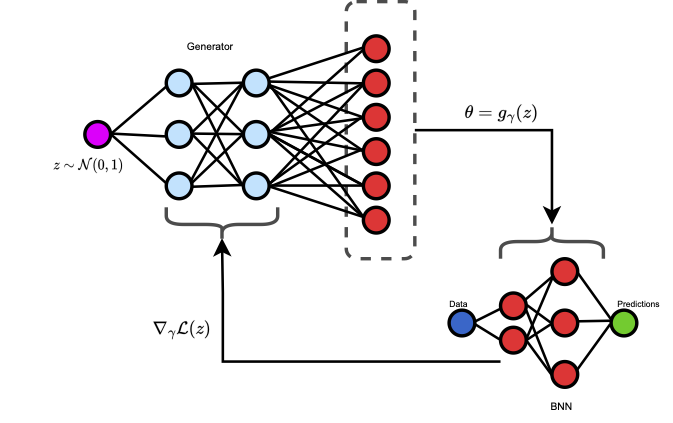

# Implicit Posteriors
This is the code-repo for the NeurIPS 2023 paper "Implicit Variational Inference for High-Dimensional Posteriors". 
[arxiv](https://arxiv.org/abs/2310.06643)

## Abstract
In variational inference, the benefits of Bayesian models rely on accurately capturing the true posterior distribution.
We propose using neural samplers that specify implicit distributions, which are well-suited for approximating complex
multimodal and correlated posteriors in high-dimensional spaces. Our approach advances inference using implicit
distributions by introducing novel bounds that come about by locally linearising the neural sampler. This is distinct
from existing methods that rely on additional discriminator networks and unstable adversarial objectives. Furthermore,
we present a new sampler architecture that, for the first time, enables implicit distributions over millions of latent
variables, addressing computational concerns by using differentiable numerical approximations. Our empirical analysis
indicates our method is capable of recovering correlations across layers in large Bayesian neural networks, a property
that is crucial for a network's performance but notoriously challenging to achieve. To the best of our knowledge, no
other method has been shown to accomplish this task for such large models. Through experiments in downstream tasks, we
demonstrate that our expressive posteriors outperform state-of-the-art uncertainty quantification methods, validating
the effectiveness of our training algorithm and the quality of the learned implicit approximation.

In one sentence our approach is about training Bayesian neural networks with implicit VI leveraging GAN style 
generators to generate weights and biases of the neural network.

  

The approach in this work uses a hypernetwork/generator/VAE decoder style network to parameterise a variational 
approximation and can be used with other latent variable models like VAEs. 

We provide the code for the experiments in the paper. The code is written in Python 3.9 and Pytorch 1.12.1.

## Requirements
Please refers to the `requirements.txt` file for checking packages and versions.

## Usage
The BNNs need to be made with reparameterisable layers. We provide a set of reparameterisable layers in the 
`bnn_src/layers.py` file. The layers are based on the reparameterisation trick where the generator produces a 
vector of parameters for the BNN layers. The parameters are samples from the approximate posterior distribution 
parameterised by the generator and used calculating losses.

#### To use the code-base provided here please follow the following steps:
1. Clone the repo.
2. Decide a generator architecture that takes a base variable and produces a vector of parameters for the BNN layers.
   1. For smaller BNNs, MLP style generators should suffice.
   2. For any BNN over 50K parameters, we recommend using the Matrix Multiplication style generator. See 
      `bnn_src/models.py` for an examples.
3. Compose BNN using the reparameterisable layers provided in `bnn_src/layers.py`.
4. Decide a base distribution for the base variable. We recommend using a Gaussian distribution.
5. Decide a prior distribution for the BNN parameters. We recommend using a Gaussian distribution.
6. Compose components from steps 1, 2, 3, and 4 into the `ImplicitBNNs` class in `bnn_src/imp_bnn.py` which also 
   provides loss functions for training using the approximate ELBO (requires specifying a likelihood for the BNN) and a 
   prediction function for making Bayesian predictions.
7. To see this flow in action please refer to `implicit_train.py`.

Additionally please check `toy_posterior_testing.ipynb` notebook for a simple toy data regression example which follows 
the same workflow as above.

**Note:** If you design your own generator architectures they have to be able to produce all the parameters of the 
BNN as that is, currently, the only supported way of training BNNs with implicit posteriors.

### Large Scale Usage
Use `CorreMMGenerator` class in `bnn_src/models.py` for large scale BNNs. This class uses a matrix multiplication 
generator for generating very high dimensional vectors of parameters of a BNN. Please refer to `gen_arch_config` 
folder to see the architecture of the generators used in the paper.

Please make sure to disable the `--accurate` flag, like in `implicit_train.py` which passes this to `ImplicitBNNs` elbo 
loss. This will make sure to use the smallest singular value numerical approximation. 
We provide all the generator architectures used in the paper in `gen_arch_config/` as `.yaml` files. These files contain
architecture description for the novel Matrix Multiplication generator/hypernetwork proposed in the paper. 

**Note** During experimentation we noticed that down-weighting the gradients from the standard normal prior in the ELBO is
helpful during training. Specifically, this allows a generator with fewer parameters to achieve good performance and thus
the ELBO loss functions take two different down-weighing arguments namely `jacobi_down_weight` and `prob_down_weight`, the
former is multiplied with the entropy term and the latter with the prior log probability. 
**ALSO NOTE** The above down-weighing is not the same as cold-posteriors!! We do not scale down the entire KL term as many
works do,rather we want all the gradient contribution from the entropy term to be able to capture a multimodal posterior 
and we only down-weigh the prior which is often naively chosen in BDL.

## Experiments
We provide functions used for generating results presented in the paper in `evaulate_models.py` and core functions 
in `bnn_src/metrics.py`. These experiments are take a lot of inspiration from the Laplace Redux work by Erik 
Daxberger et. al. in NeurIPS 2020 to standardise UQ testing across different methods.

## Upcoming features
1. Support for DNN to BNN api like bayesian-torch library available here - https://github.com/IntelLabs/bayesian-torch
2. Sub-stochastic BNN implementation with implicit approximations for the posterior. This would enable 
   unconventional training of BNNs with priors over selected parameters of the BNN (e.g. last layer).

